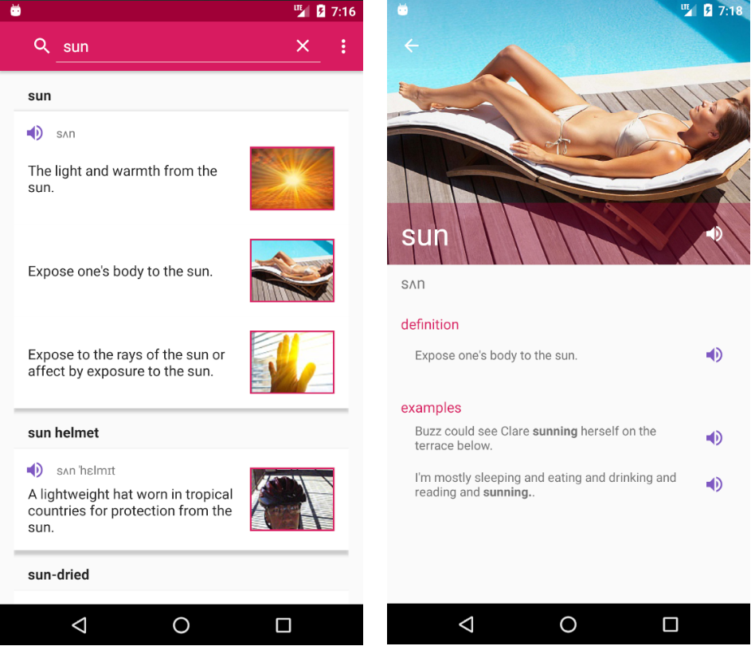

# twords dictionary
English dictionary with images and sounds based on the open Skyeng api.

play market: https://play.google.com/store/apps/details?id=com.tuvv.twords

The app has two flavors: prod and dummy (the latter to simulate the real api).
